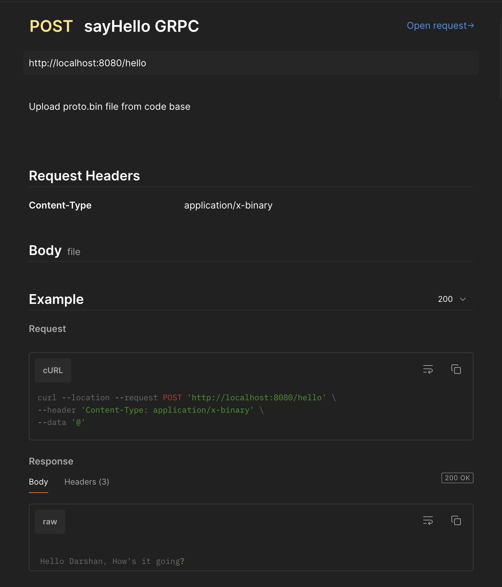

**Testing RESTful APIs with protobuf encoding**

Create binary data file using util/generateBinaryEncoding.go

_Note: if stuck in binary conversion, search bell character [bin value 7]_

Add data.bin file as binary input

add following header
```http request
Content-Type:application/x-binary
```

Make Http Request
```http request
http://localhost:8080/hello
```

**Postman setup example:**

ayHello using binary/protobuf over http/1.x

